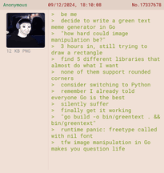
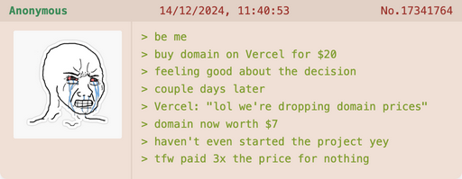

# greentext CLI

The Green-Text Meme Generator CLI is a command-line tool built with Go that lets you create classic green-text memes with ease.

<p align="center">
  
</p>

## Features

- **Customizable Inputs**: Write your own green-text stories with ease.
- **Thumbnail Support**: Add an image to your meme, or use the built-in placeholder if you're feeling minimalist.
- **Support for External Thumbnails**: Use image URLs as thumbnails for your memes.
- **Customizable Colors**: Set background and text colors using HEX codes.
- **Dynamic Font Options**: Choose your preferred font and size.
- **Fast and Lightweight**: Powered by Go, because performance matters even when making memes.
- **Formatted Output**: Saves memes as beautifully formatted PNGs, JPGs, JPEGs, and WEBPs ready for sharing.

## Installation

### Using Homebrew

1. Add the tap:

   ```bash
   brew tap jasonuc/greentext
   ```

2. Install the CLI:

   ```bash
   brew install greentext
   ```

### Manual Installation

1. Install [Go](https://golang.org/dl/) if not already installed.
2. Install the CLI directly:

   ```bash
   go install github.com/jasonuc/greentext@latest
   ```

   Or clone and build:

   ```bash
   git clone https://github.com/jasonuc/greentext.git
   cd greentext
   go build -o bin/greentext .
   ```

3. Run the tool:

   ```bash
   bin/greentext -h
   ```

## Usage

### Generate a Meme

```bash
greentext -l 13 -t https://wojakdb.com/data/posts/3571_9009cb2dd906dccb.png -o meme.png
```

- `-l`: Number of lines in the meme.
- `-t`: Thumbnail image path or URL (optional).
- `-o`: Output file name.

### Key Flags

- `-b`: Background color (e.g., `#FFFFFF`).
- `-c`: Text color (e.g., `#00FF00`).
- `-f`: Font family (e.g., `"Courier New"`).
- `-s`: Font size (e.g., `14`).
- `-i`: Text file with greentext lines.
- `-P`: Preview in browser without saving.

### Example Input

```text
> be me
> buy domain on Vercel for $20
> feeling good about the decision
> couple days later
> Vercel: "lol we're dropping domain prices"
...
```

### Example Output

Generates a meme like:



## Contributing

Contributions are welcome! Open an issue or pull request for ideas or fixes.

## License

This project is licensed under the MIT License. See the [LICENSE](LICENSE) file for details.

Happy meme-ing! 🚀
