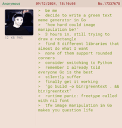
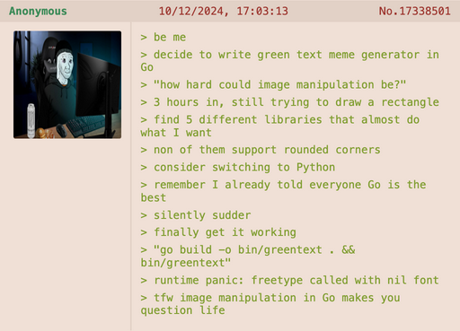

# greentext CLI

The Green-Text Meme Generator CLI is a command-line tool built with Go that lets you create classic green-text memes with ease.

<p align="center">
  
</p>

## Features

- **Customizable Inputs**: Write your own green-text stories with ease.
- **Thumbnail Support**: Add an image to your meme, or use the built-in placeholder if you're feeling minimalist.
- **Support for External Thumbnails**: Use image URLs as thumbnails for your memes.
- **Customizable Colors**: Set background and text colors using HEX codes.
- **Dynamic Font Options**: Choose your preferred font and size.
- **Fast and Lightweight**: Powered by Go, because performance matters even when making memes.
- **Formatted Output**: Saves memes as beautifully formatted PNGs, ready for sharing.

## Installation

### Using Homebrew

You can now install the CLI tool via Homebrew using a personal tap:

1. Add the tap:

   ```bash
   brew tap jasonuc/greentext
   ```

2. Install the CLI:

   ```bash
   brew install greentext
   ```

### Manual Installation

1. Make sure you have [Go](https://golang.org/dl/) installed on your machine.
2. Install the CLI tool directly:

   ```bash
   go install github.com/jasonuc/greentext@latest
   ```

3. Or clone the repository:

   ```bash
   git clone https://github.com/jasonuc/greentext.git
   ```

4. Navigate to the project directory:

   ```bash
   cd greentext
   ```

5. Build the CLI tool:

   ```bash
   go build -o bin/greentext .
   ```

6. Run the tool:

   ```bash
   bin/greentext -h
   ```

## Usage

Here’s how you can generate your very own green-text meme:

### Example Command

```bash
greentext -l 13 -t https://wojakdb.com/data/posts/3571_9009cb2dd906dccb.png -o meme.png
```

- `-l`: Number of lines to include in the green-text.
- `-t`: Path to a thumbnail image or URL (optional).
- `-o`: Output file name.

#### Additional Flags

- `--background-color`, `-b`: Set the background color for the meme in HEX format (e.g., `#FFFFFF` for white, default: `#f0e0d6`).
- `--text-color`, `-c`: Set the text color for the greentext lines in HEX format (e.g., `#00FF00` for green, default: `#819f32`).
- `--font`, `-f`: Specify the font family for the entire meme (e.g., `"Courier New"`, default: `"Roboto Mono"`).
- `--font-size`, `-s`: Specify the font size for the greentext lines in pixels (e.g., `14`, default: `12`).
- `--input-file`, `-i`: Provide a text file containing greentext lines (one line per entry).
- `--preview-only`, `-P`: Open the meme in the browser without saving it.

### Example Input

When prompted, enter your meme lines:

```text
> be me
> decide to write a meme generator in Go
> "how hard could image manipulation be?"
> 3 hours in, still trying to draw a rectangle
> find 5 different libraries that almost do what I want
> none of them support rounded corners
> consider switching to Python
> remember I already told everyone Go is the best
> silently suffer
> finally get it working
> "go build -o bin/greentext"
> runtime panic: freetype called with nil font
> tfw image manipulation in Go makes you question life
```

### Example Output

This command will generate a beautiful green-text meme like this:



## Contributing

Contributions are welcome! Whether you find a bug, have an idea for a new feature, or just want to improve the documentation, feel free to open an issue or submit a pull request.

## License

This project is licensed under the MIT License. See the [LICENSE](LICENSE) file for details.

Happy meme-ing! 🚀
